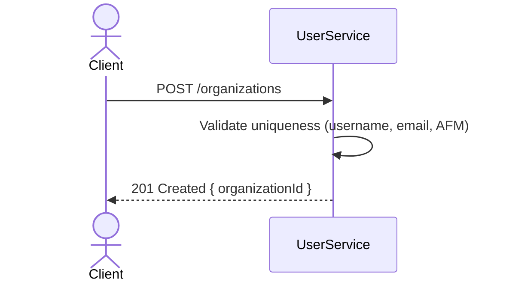
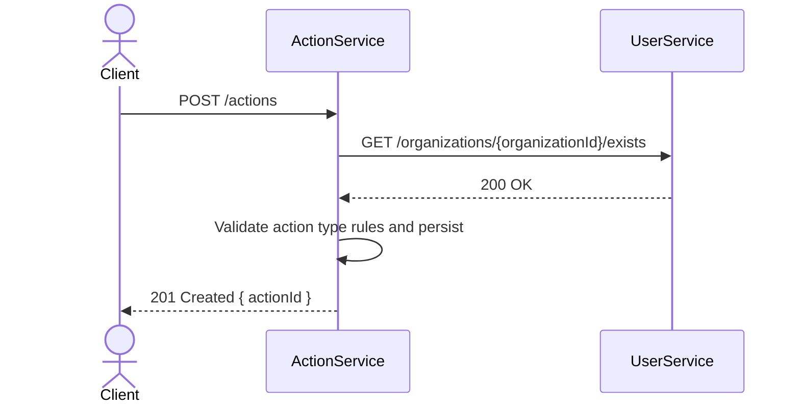
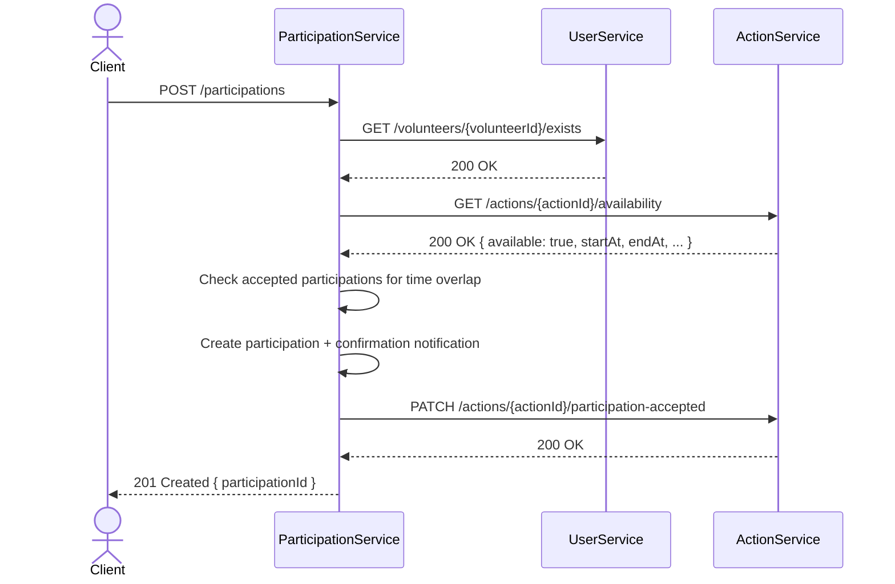
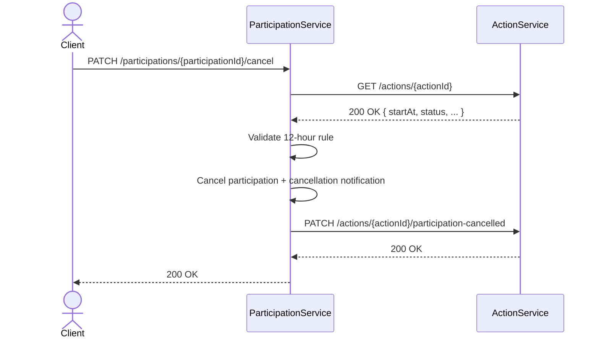
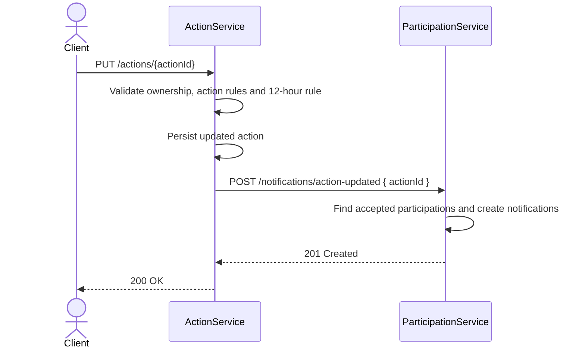
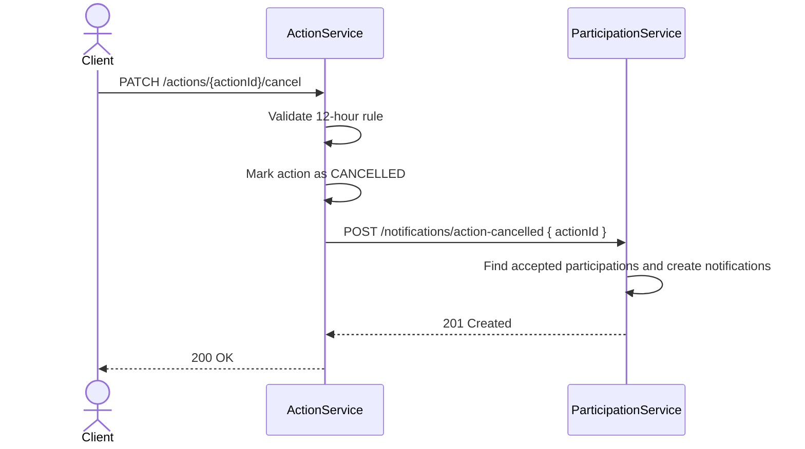
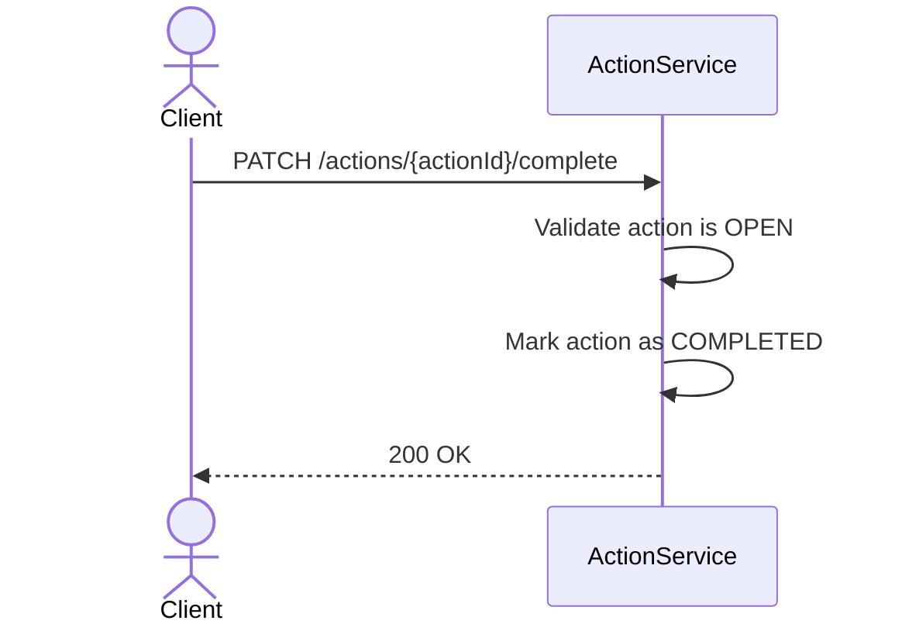

# Παραδοτέο Α — Σχεδίαση Συστήματος με Microservices

## Επισκόπηση

Η υπάρχουσα μονολιθική εφαρμογή διαχείρισης εθελοντικών δράσεων επεκτείνεται σε αρχιτεκτονική microservices. Η λειτουργικότητα κατανέμεται σε τρία ανεξάρτητα services:

| Microservice | Κύρια ευθύνη | Βάση δεδομένων |
| --- | --- | --- |
| `user-service` | Διαχείριση εθελοντών και οργανισμών | H2 (ανεξάρτητη) |
| `action-service` | Διαχείριση δράσεων εθελοντισμού | H2 (ανεξάρτητη) |
| `participation-service` | Διαχείριση συμμετοχών και ειδοποιήσεων | H2 (ανεξάρτητη) |

Κάθε service εκθέτει REST API μέσω JAX-RS. Η επικοινωνία μεταξύ services γίνεται αποκλειστικά μέσω REST κλήσεων (MicroProfile REST Client) — δεν υπάρχει κοινή βάση δεδομένων.

---

## 1. Περιγραφή του API

### Αρχές σχεδίασης REST

- Resources ορίζονται με ουσιαστικά σε πληθυντικό: `/volunteers`, `/actions`, `/participations`
- HTTP methods: `GET`, `POST`, `PUT`, `PATCH`, `DELETE` 
- Payloads και responses σε JSON
- HTTP status codes: `200 OK`, `201 Created`, `204 No Content`, `400 Bad Request`, `404 Not Found`, `409 Conflict`, `503 Service Unavailable`

---

### 1.1 User Service API

#### Volunteers

| Μέθοδος | Endpoint | Περιγραφή | Status (επιτυχία / σφάλμα) |
| --- | --- | --- | --- |
| `POST` | `/volunteers` | Δημιουργία εθελοντή | 201 / 400, 409 |
| `GET` | `/volunteers` | Λίστα εθελοντών | 200 |
| `GET` | `/volunteers/{volunteerId}` | Ανάκτηση εθελοντή | 200 / 404 |
| `PUT` | `/volunteers/{volunteerId}` | Ενημέρωση εθελοντή | 200 / 400, 404 |
| `DELETE` | `/volunteers/{volunteerId}` | Διαγραφή εθελοντή | 204 / 404 |

```json
POST /volunteers
{
  "username": "maria",
  "password": "secret",
  "email": "maria@example.com",
  "mobile": "6900000000",
  "firstName": "Μαρία",
  "lastName": "Παπαδοπούλου",
  "address": { "street": "Πατησίων", "number": "76", "zipCode": "10434", "city": "Αθήνα" }
}
```

#### Organizations

| Μέθοδος | Endpoint | Περιγραφή | Status (επιτυχία / σφάλμα) |
| --- | --- | --- | --- |
| `POST` | `/organizations` | Δημιουργία οργανισμού | 201 / 400, 409 |
| `GET` | `/organizations` | Λίστα οργανισμών | 200 |
| `GET` | `/organizations/{organizationId}` | Ανάκτηση οργανισμού | 200 / 404 |
| `PUT` | `/organizations/{organizationId}` | Ενημέρωση οργανισμού | 200 / 400, 404 |
| `DELETE` | `/organizations/{organizationId}` | Διαγραφή οργανισμού | 204 / 404 |

```json
POST /organizations
{
  "username": "help-org",
  "password": "secret",
  "email": "info@help-org.gr",
  "mobile": "2100000000",
  "organizationName": "Help Org",
  "afm": "123456789",
  "descriptionOfOrganization": "Κοινωνική προσφορά",
  "descriptionOfAction": "Δράσεις προσφοράς και χρηματοδότησης",
  "yearOfEstablishment": 2010,
  "address": { "street": "Σταδίου", "number": "10", "zipCode": "10562", "city": "Αθήνα" }
}
```

---

### 1.2 Action Service API

Τύποι δράσεων: `ACTIVISM` (ακτιβισμός με min/max συμμετεχόντων), `CONTRIBUTE` (προσφορά προϊόντων), `FUNDING` (χρηματοδότηση με ποσό-στόχο).

| Μέθοδος | Endpoint | Περιγραφή | Status (επιτυχία / σφάλμα) |
| --- | --- | --- | --- |
| `POST` | `/actions` | Δημιουργία δράσης | 201 / 400, 404 |
| `GET` | `/actions` | Αναζήτηση δράσεων | 200 |
| `GET` | `/actions/{actionId}` | Ανάκτηση δράσης | 200 / 404 |
| `PUT` | `/actions/{actionId}` | Ενημέρωση δράσης | 200 / 400, 404, 409 |
| `PATCH` | `/actions/{actionId}/cancel` | Ακύρωση δράσης | 200 / 404, 409 |
| `PATCH` | `/actions/{actionId}/complete` | Ολοκλήρωση δράσης | 200 / 404, 409 |
| `GET` | `/organizations/{organizationId}/actions` | Δράσεις οργανισμού | 200 / 404 |

Query parameters για `GET /actions`: `type` (`ACTIVISM`/`CONTRIBUTE`/`FUNDING`), `status` (`OPEN`/`COMPLETED`/`CANCELLED`), `city`, `from`, `to`, `organizationId`.

```json
POST /actions  (ACTIVISM)
{
  "type": "ACTIVISM",
  "organizationId": 15,
  "title": "Καθαρισμός παραλίας",
  "actionDescription": "Εθελοντικός καθαρισμός ακτής",
  "startAt": "2026-06-10T09:00:00",
  "endAt": "2026-06-10T13:00:00",
  "location": "Άλιμος",
  "minParticipants": 10,
  "totalParticipants": 40
}
```

```json
POST /actions  (CONTRIBUTE)
{
  "type": "CONTRIBUTE",
  "organizationId": 15,
  "title": "Συγκέντρωση τροφίμων",
  "actionDescription": "Συγκέντρωση βασικών αγαθών",
  "startAt": "2026-06-01T10:00:00",
  "endAt": "2026-06-15T18:00:00",
  "location": "Αθήνα",
  "products": [
    { "name": "Ρύζι", "targetQuantity": 100 },
    { "name": "Γάλα", "targetQuantity": 80 }
  ]
}
```

```json
POST /actions  (FUNDING)
{
  "type": "FUNDING",
  "organizationId": 15,
  "title": "Υποστήριξη κοινωνικού παντοπωλείου",
  "actionDescription": "Συγκέντρωση χρημάτων",
  "startAt": "2026-06-01T10:00:00",
  "endAt": "2026-06-30T18:00:00",
  "targetAmount": 5000.0
}
```

---

### 1.3 Participation Service API

| Μέθοδος | Endpoint | Περιγραφή | Status (επιτυχία / σφάλμα) |
| --- | --- | --- | --- |
| `POST` | `/participations` | Δήλωση συμμετοχής | 201 / 400, 404, 409 |
| `GET` | `/participations` | Λίστα συμμετοχών | 200 |
| `GET` | `/participations/{participationId}` | Ανάκτηση συμμετοχής | 200 / 404 |
| `PATCH` | `/participations/{participationId}/cancel` | Ακύρωση συμμετοχής | 200 / 404, 409 |
| `GET` | `/volunteers/{volunteerId}/participations` | Συμμετοχές εθελοντή | 200 / 404 |
| `GET` | `/actions/{actionId}/participations` | Συμμετοχές δράσης | 200 / 404 |
| `GET` | `/volunteers/{volunteerId}/notifications` | Ειδοποιήσεις εθελοντή | 200 / 404 |
| `PATCH` | `/notifications/{notificationId}/read` | Σήμανση ως αναγνωσμένη | 200 / 404 |

Query parameters για `GET /participations`: `volunteerId`, `actionId`, `status` (`ACCEPTED`/`CANCELLED`).

```json
POST /participations  (ACTIVISM)
{ "type": "ACTIVISM", "volunteerId": 21, "actionId": 100 }
```

```json
POST /participations  (FUNDING)
{ "type": "FUNDING", "volunteerId": 21, "actionId": 101, "amount": 25.0 }
```

```json
POST /participations  (CONTRIBUTE)
{
  "type": "CONTRIBUTE",
  "volunteerId": 21,
  "actionId": 102,
  "products": [
    { "productId": 1, "quantity": 5 },
    { "productId": 2, "quantity": 3 }
  ]
}
```

---

### 1.4 Internal REST API μεταξύ microservices

Τα παρακάτω endpoints δεν χρησιμοποιούνται απευθείας από τον τελικό client. Αποτελούν REST συμβόλαια μεταξύ microservices, ώστε κάθε service να παραμένει αυτόνομο και να ανταλλάσσει μόνο τα απαραίτητα δεδομένα.

| Service | Μέθοδος | Endpoint | Χρήση |
| --- | --- | --- | --- |
| `user-service` | `GET` | `/volunteers/{volunteerId}/exists` | Επαλήθευση ότι υπάρχει εθελοντής πριν από συμμετοχή |
| `user-service` | `GET` | `/organizations/{organizationId}/exists` | Επαλήθευση ότι υπάρχει οργανισμός πριν από δημιουργία δράσης |
| `action-service` | `GET` | `/actions/{actionId}/availability` | Έλεγχος κατάστασης, χωρητικότητας και χρονικών ορίων δράσης |
| `action-service` | `PATCH` | `/actions/{actionId}/participation-accepted` | Ενημέρωση μετρητών μετά από νέα συμμετοχή |
| `action-service` | `PATCH` | `/actions/{actionId}/participation-cancelled` | Αποδέσμευση μετρητών μετά από ακύρωση συμμετοχής |
| `participation-service` | `POST` | `/notifications/action-updated` | Δημιουργία ειδοποιήσεων μετά από τροποποίηση δράσης |
| `participation-service` | `POST` | `/notifications/action-cancelled` | Δημιουργία ειδοποιήσεων μετά από ακύρωση δράσης |

---

## 2. Κατανομή λειτουργικότητας στα microservices

### 2.1 User Service

**Ρόλος:** Διαχειρίζεται την ταυτότητα και τα προφίλ των χρηστών του συστήματος.

**Οντότητες:** `User`, `Volunteer`, `Organization`, `Address`

**Ευθύνες:**
- Δημιουργία, ανάκτηση, ενημέρωση και διαγραφή εθελοντών και οργανισμών
- Έλεγχος μοναδικότητας username, email και AFM κατά τη δημιουργία
- Παροχή internal endpoints για επαλήθευση ύπαρξης χρήστη από άλλα services

**API που υποστηρίζεται** (βλ. §1.1):
`POST/GET/PUT/DELETE /volunteers`, `POST/GET/PUT/DELETE /organizations`,
`GET /volunteers/{id}/exists`, `GET /organizations/{id}/exists`

---

### 2.2 Action Service

**Ρόλος:** Διαχειρίζεται τον κατάλογο δράσεων και τους κανόνες ζωής τους.

**Οντότητες:** `Action`, `ActivismAction`, `ContributeAction`, `FundingAction`, `Product`

**Ευθύνες:**
- Δημιουργία, ανάκτηση, ενημέρωση, ακύρωση και ολοκλήρωση δράσεων
- Αναζήτηση δράσεων με φίλτρα (τύπος, κατάσταση, τοποθεσία, χρονικό διάστημα)
- Έλεγχος διαθεσιμότητας για νέα συμμετοχή
- Ενημέρωση μετρητών (currentParticipants, raisedAmount, remainingQuantity) μετά από δήλωση ή ακύρωση συμμετοχής
- Ενημέρωση του `participation-service` όταν μια δράση τροποποιείται ή ακυρώνεται, ώστε να ειδοποιηθούν οι συμμετέχοντες
- Αποθηκεύει μόνο `organizationId` — δεν προσπελαύνει δεδομένα του `user-service`

**API που υποστηρίζεται** (βλ. §1.2):
`POST/GET/PUT /actions`, `PATCH /actions/{id}/cancel`, `PATCH /actions/{id}/complete`,
`GET /organizations/{id}/actions`,
`GET /actions/{id}/availability`, `PATCH /actions/{id}/participation-accepted`,
`PATCH /actions/{id}/participation-cancelled`

---

### 2.3 Participation Service

**Ρόλος:** Διαχειρίζεται τις δηλώσεις συμμετοχής και τις ειδοποιήσεις.

**Οντότητες:** `Participation`, `ActivismParticipation`, `ContributeParticipation`, `FundingParticipation`, `ParticipationProduct`, `Notification`

**Ευθύνες:**
- Δημιουργία και ακύρωση συμμετοχών, με επαλήθευση εθελοντή και δράσης μέσω REST
- Εφαρμογή επιχειρησιακών κανόνων: απαγόρευση ακύρωσης < 12 ώρες πριν την έναρξη, δεν επιτρέπεται συμμετοχή σε ακυρωμένη/ολοκληρωμένη δράση, δεν επιτρέπεται συμμετοχή εθελοντή σε ταυτόχρονες δράσεις
- Δημιουργία ειδοποιήσεων για: επιβεβαίωση συμμετοχής, ακύρωση συμμετοχής, τροποποίηση δράσης, ακύρωση δράσης
- Αποθηκεύει μόνο `volunteerId` και `actionId`

**API που υποστηρίζεται** (βλ. §1.3):
`POST/GET /participations`, `GET /participations/{id}`, `PATCH /participations/{id}/cancel`,
`GET /volunteers/{id}/participations`, `GET /actions/{id}/participations`,
`GET /volunteers/{id}/notifications`, `PATCH /notifications/{id}/read`,
`POST /notifications/action-updated`, `POST /notifications/action-cancelled`

---

### 2.4 Τεκμηρίωση διάσπασης

- **Υψηλή συνεκτικότητα (High Cohesion):**
  Κάθε microservice είναι υπεύθυνο για μία συγκεκριμένη επιχειρησιακή λειτουργία του συστήματος. Έτσι, όλη η σχετική λογική και τα δεδομένα συγκεντρώνονται σε μία υπηρεσία, γεγονός που κάνει τον κώδικα πιο οργανωμένο και ευκολότερο στην κατανόηση.

- **Χαμηλή σύζευξη (Low Coupling):**
  Τα microservices επικοινωνούν μόνο μέσω καλά ορισμένων REST APIs, χωρίς άμεση εξάρτηση από την εσωτερική υλοποίηση ή τη βάση δεδομένων άλλων υπηρεσιών. Με αυτόν τον τρόπο, αλλαγές σε ένα service επηρεάζουν ελάχιστα τα υπόλοιπα.

- **Ανεξάρτητο Deployment:**
  Κάθε microservice μπορεί να αναπτυχθεί, να ενημερωθεί ή να επανεκκινηθεί ανεξάρτητα από τα υπόλοιπα services. Αυτό επιτρέπει ταχύτερες αναβαθμίσεις και μειώνει τον κίνδυνο να επηρεαστεί ολόκληρο το σύστημα από μία αλλαγή.

- **Ευκολότερη Συντήρηση και Επεκτασιμότητα:**
  Η διάσπαση του συστήματος σε μικρότερες και ανεξάρτητες υπηρεσίες διευκολύνει τη συντήρηση, τον εντοπισμό σφαλμάτων και την προσθήκη νέων λειτουργιών. Παράλληλα, κάθε υπηρεσία μπορεί να κλιμακωθεί ξεχωριστά ανάλογα με τις ανάγκες φόρτου του συστήματος.

Στη μονολιθική εφαρμογή οι οντότητες συνδέονταν με JPA relationships (`Action → Organization`, `Participation → Volunteer/Action`). Στη microservices αρχιτεκτονική αυτές αντικαθίστανται από αναφορές μέσω ID, ώστε κάθε service να διατηρεί πλήρη αυτονομία.

---

## 3. Αλληλεπίδραση microservices μέσω REST

### 3.1 Δημιουργία οργανισμού

Η ροή αφορά αποκλειστικά το `user-service`. Ο client στέλνει τα στοιχεία του οργανισμού, το service επαληθεύει μοναδικότητα username, email και AFM, και επιστρέφει το νέο `organizationId`. Δεν υπάρχει επικοινωνία με άλλα services.



Εναλλακτική: duplicate username/email/AFM → `409 Conflict`.

---

### 3.2 Δημιουργία δράσης από οργανισμό

Όταν ένας οργανισμός δημιουργεί δράση, το `action-service` πρέπει να επαληθεύσει ότι ο οργανισμός υπάρχει. Για αυτό καλεί το `user-service` με το `organizationId` πριν αποθηκεύσει τη δράση. Αν η επαλήθευση επιτύχει, εφαρμόζονται οι επιχειρησιακοί κανόνες του τύπου δράσης και η δράση αποθηκεύεται.



Εναλλακτικές: οργανισμός δεν υπάρχει → `404 Not Found`. `user-service` μη διαθέσιμο → `503 Service Unavailable`.

---

### 3.3 Δήλωση συμμετοχής εθελοντή

Η δήλωση συμμετοχής απαιτεί επαλήθευση τόσο του εθελοντή όσο και της δράσης, οπότε το `participation-service` κάνει REST κλήσεις και στα δύο άλλα services. Πρώτα ελέγχει αν ο εθελοντής υπάρχει μέσω `user-service`, μετά αν η δράση είναι `OPEN` και διαθέσιμη μέσω `action-service`. Στη συνέχεια ελέγχει ότι ο εθελοντής δεν έχει ήδη αποδεκτή συμμετοχή σε άλλη δράση που πραγματοποιείται στο ίδιο χρονικό διάστημα. Αν όλοι οι έλεγχοι περάσουν, δημιουργείται η συμμετοχή, ενημερώνονται οι μετρητές της δράσης και δημιουργείται ειδοποίηση επιβεβαίωσης.



Εναλλακτικές: εθελοντής δεν υπάρχει → `404`. Δράση `CANCELLED`/`COMPLETED` ή χωρίς διαθέσιμες θέσεις → `409 Conflict`. Ο εθελοντής συμμετέχει ήδη σε ταυτόχρονη δράση → `409 Conflict`.

---

### 3.4 Ακύρωση συμμετοχής

Πριν ακυρωθεί η συμμετοχή, το `participation-service` πρέπει να γνωρίζει την ημερομηνία έναρξης της δράσης για να εφαρμόσει τον κανόνα των 12 ωρών. Καλεί το `action-service` για να λάβει τα στοιχεία της δράσης. Αν η ακύρωση επιτρέπεται, η συμμετοχή ακυρώνεται, οι μετρητές αποδεσμεύονται και δημιουργείται ειδοποίηση ακύρωσης.



Εναλλακτική: απομένουν < 12 ώρες πριν την έναρξη → `409 Conflict`.

---

### 3.5 Τροποποίηση δράσης από οργανισμό

Όταν ένας οργανισμός τροποποιεί μια δράση, το `action-service` εφαρμόζει τους κανόνες εγκυρότητας της δράσης και τον κανόνα των 12 ωρών για αλλαγές κοντά στην έναρξη. Μετά την αποθήκευση της αλλαγής καλεί το `participation-service`, ώστε οι εθελοντές που έχουν αποδεκτή συμμετοχή να λάβουν ειδοποίηση τροποποίησης.



Εναλλακτικές: δράση δεν υπάρχει → `404 Not Found`. Αλλαγή < 12 ώρες πριν την έναρξη → `409 Conflict`. `participation-service` μη διαθέσιμο → `503 Service Unavailable`.

---

### 3.6 Ακύρωση δράσης από οργανισμό

Όταν ακυρωθεί μια δράση, όλοι οι εθελοντές που έχουν δηλώσει συμμετοχή πρέπει να ειδοποιηθούν. Το `action-service` ακυρώνει τη δράση και στη συνέχεια καλεί το `participation-service` για να δημιουργήσει ειδοποιήσεις για τους ενεργούς συμμετέχοντες. Ο κανόνας των 12 ωρών εφαρμόζεται και εδώ.



Εναλλακτική: απομένουν < 12 ώρες πριν την έναρξη → `409 Conflict`.

---

### 3.7 Ολοκλήρωση δράσης

Η ολοκλήρωση δράσης αφορά αποκλειστικά το `action-service`. Δεν απαιτείται επικοινωνία με άλλα services, καθώς οι επιχειρησιακοί κανόνες δεν ορίζουν αποστολή ειδοποιήσεων κατά την ολοκλήρωση. Η δράση μεταβαίνει σε κατάσταση `COMPLETED` και δεν γίνονται πλέον δεκτές νέες συμμετοχές.



Εναλλακτική: δράση ήδη `COMPLETED` ή `CANCELLED` → `409 Conflict`.
